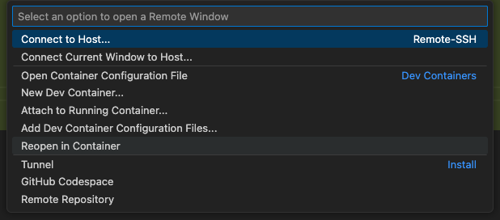

# Demo for minimal setup for using node in devcontainers

This is a minimal Dev Container setup for Node.js 20 with `npm`, exposing a web server on port `5000`.

## Use

1. Open this folder in VS Code.
2. Install the "Dev Containers" extension if you don't have it: https://marketplace.visualstudio.com/items?itemName=ms-vscode-remote.remote-containers
3. Reopen in container when prompted or call Dev Containers: Reopen in Container:
